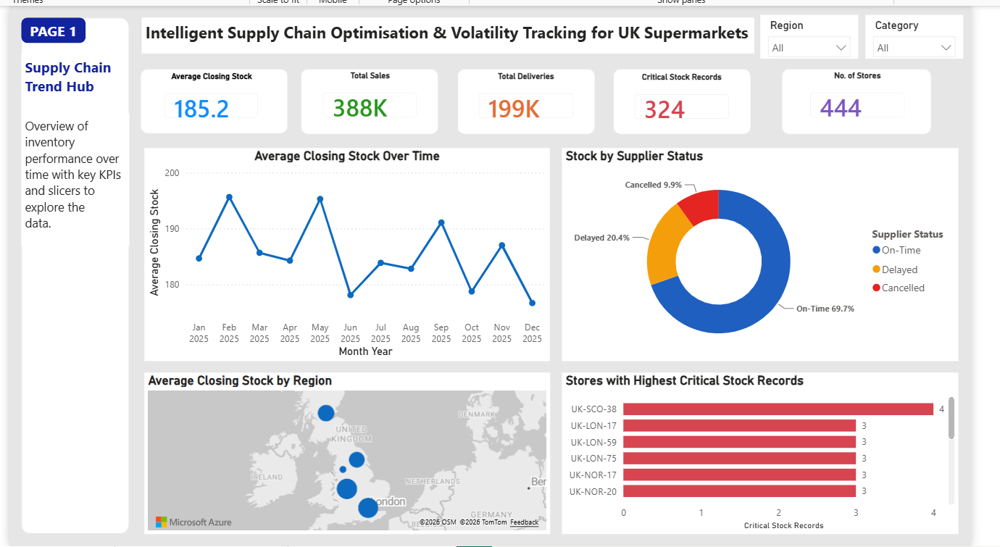
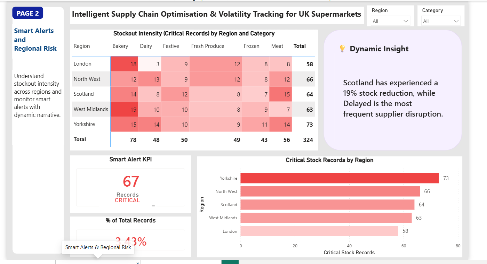
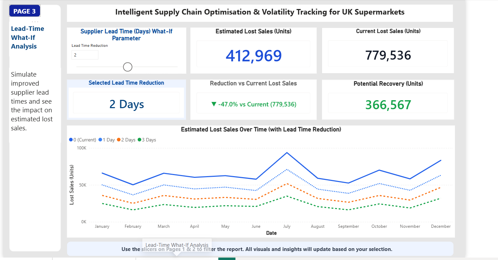
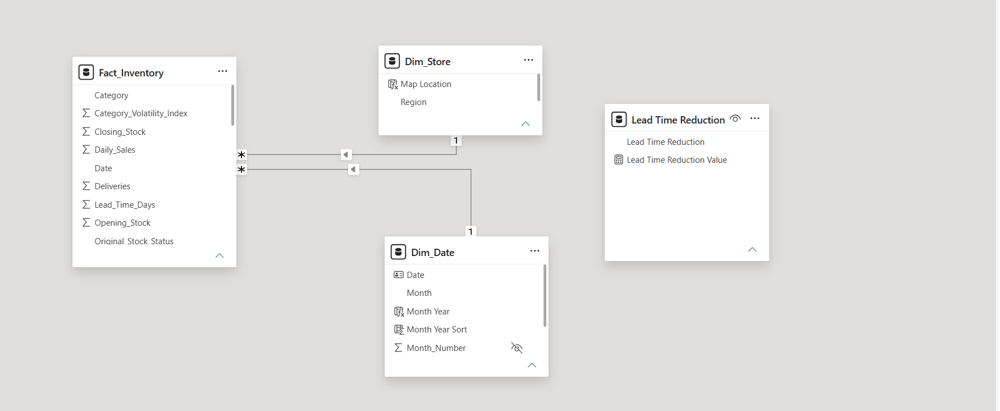

# UK Supermarket Inventory Risk Analytics

This project looks at supermarket inventory, supplier delays and stock risk using Azure, Microsoft Fabric, SQL and Power BI.

The work started with a CSV file containing 2,000 daily inventory records. The file was uploaded to Azure Blob Storage, copied into a Fabric Lakehouse, cleaned with PySpark, analysed with SQL and then used to build a three-page Power BI report.

## Project flow

Local CSV file  
→ Azure Blob Storage  
→ Microsoft Fabric Data Factory pipeline  
→ Fabric Lakehouse Bronze folder  
→ PySpark cleaning and validation  
→ Quarantine file and Delta table  
→ SQL analytics endpoint  
→ Power BI report

## Main results

- 2,000 source records
- 44 invalid records moved to quarantine
- 1,956 valid records retained
- 64 stock-status labels corrected
- 14 columns in the final Lakehouse table
- 4 SQL analysis queries
- 3 Power BI report pages

## Tools used

- Azure Blob Storage
- Microsoft Fabric Data Factory
- Microsoft Fabric Lakehouse
- PySpark
- Fabric SQL analytics endpoint
- Power BI
- Power Query
- DAX

## Data preparation

The original file was copied into the Lakehouse Bronze folder without changing its contents.

The PySpark notebook then:

- converted the source date into a proper date field
- checked the numeric columns
- identified impossible inventory records
- separated rejected rows into a quarantine file
- recalculated stock-status values
- created a supplier reliability score
- created a category volatility index

A record was treated as invalid when:

`Daily_Sales > Opening_Stock + Deliveries`

The 44 records that failed this rule were saved separately instead of being deleted.

## SQL analysis

Four SQL queries were created against the cleaned Lakehouse table:

1. Chronic Under-Delivery Detector
2. Perfect Storm Vulnerability Finder
3. Supplier Impact Stress Test
4. False Alarm Audit

The query files and result screenshots are available in:

`06_sql_analytics_endpoint`

## Power BI report

The final report contains three pages.

### 1. Supply Chain Trend Hub

This page gives an overview of stock, sales, deliveries, supplier status and regional performance.



### 2. Smart Alerts & Regional Risk

This page focuses on critical stock records, regional risk and the smart-alert condition.



### 3. Lead-Time What-If Analysis

This page tests the effect of reducing supplier lead time by one, two or three days.



## Power BI data model

The report uses a simple star schema:

- `Fact_Inventory`
- `Dim_Date`
- `Dim_Store`

The `Lead Time Reduction` table is disconnected from the main model and is used for the what-if parameter.



## Repository structure

```text
01_source_data
02_azure_blob_storage
03_fabric_data_pipeline
04_fabric_lakehouse
05_fabric_python_notebooks
06_sql_analytics_endpoint
07_power_bi
09_documentation
```

## Files to review

- PySpark notebook: `05_fabric_python_notebooks/notebooks`
- SQL queries: `06_sql_analytics_endpoint/sql`
- Power BI file: `07_power_bi/report`
- DAX measures: `07_power_bi/dax_measures/dax_measures.md`
- Challenges and solutions: `09_documentation/challenges_and_solutions.md`

## Security note

Storage keys, connection strings and other credentials are not included in this repository.
